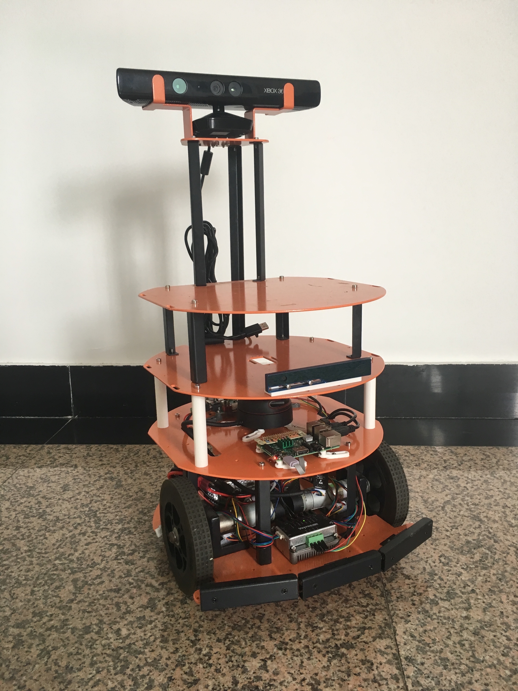

# HCRbot ROS Package

The repository contains ROS packages for HCRbot.

The related firmware is at repository: [https://github.com/chenzhongxian/hcr_ros_firmware](https://github.com/chenzhongxian/hcr_ros_firmware)

For more information, please refer my homepage on Medium: [https://medium.com/@xyxy](https://medium.com/@xyxy)

## Demo

### HCRbot SLAM Demo

or you can visit [https://v.qq.com/x/page/h0521hhktdn.html]((https://v.qq.com/x/page/h0521hhktdn.html)) for video version.

### HCRbot Navigation Demo

or you can visit [https://v.qq.com/x/page/h0521n8lebw.html](https://v.qq.com/x/page/h0521n8lebw.html) for video version.

### HCRbot 3D SLAM Demo

or you can visit [https://v.qq.com/x/page/e05237crki8.html](https://v.qq.com/x/page/e05237crki8.html) for video version.

## Documents

[HCRbot 1: Introduction](https://medium.com/@xyxy/hcrbot-1-introduction-6ad86c9c9890)

[HCRbot 2: Hardware Setup](https://medium.com/@xyxy/hcrbot-2-hardware-setup-dd07c203b69a)

[HCRbot 3: PC Software Setup](https://medium.com/@xyxy/hcrbot-3-pc-software-setup-bce69ba5088e)

[HCRbot 4.1: SBC Software Setup - Raspberry Pi 3](https://medium.com/@xyxy/hcrbot-4-1-sbc-software-setup-raspberry-pi-3-7101a7acb696)

[HCRbot 4.2: SBC Software Setup - Odroid XU4](https://medium.com/@xyxy/hcrbot-4-2-sbc-software-setup-odroid-xu4-523b6179ad98)

[HCRbot 5: OpenCR Software Setup](https://medium.com/@xyxy/hcrbot-5-opencr-software-setup-53f94d39c088)

[HCRbot 6: Bringup](https://medium.com/@xyxy/hcrbot-6-bringup-40d00aba691a)

[HCRbot 7: Teleopration](https://medium.com/@xyxy/hcrbot-7-teleopration-c7fec2c6d1d)

[HCRbot 8: 2D SLAM]

[HCRbot 9: 2D Navigation]

[HCRbot 10: Application]

[HCRbot 11: 3D SLAM and Navigation]

and more……

## Contact

Homepage: [https://medium.com/@xyxy](https://medium.com/@xyxy)

Mail: xyxybot@gmail.com

Wechat: chen_zhongxian

